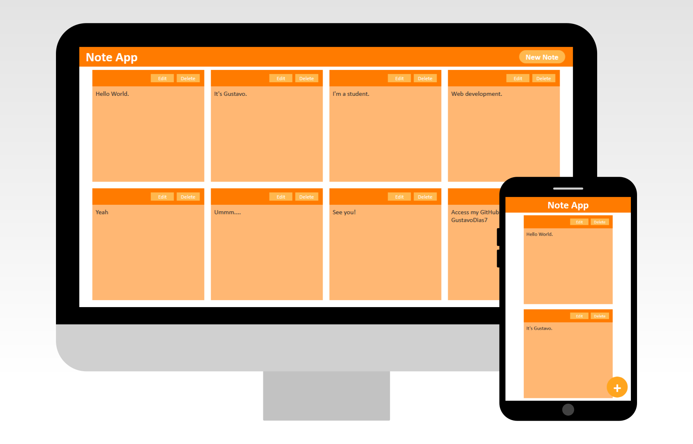

<br />
<p align="center">
  <a href="./desgin/note-app-desktop-mobile.png">
    
  </a>

  <h3 align="center">Note App</h3>

  <p align="center">
    A application to save your notes and texts!
    <br />
    <a href="https://gustavodias7.github.io/note-app/">View Demo</a>
    <br />
    <a href="https://github.com/GustavoDias7/note-app/issues">Report Bug And Request Feature</a>
  </p>
</p>

## About The Project

This project was born out of my need to have a place where I could easily store my texts and notes. I practiced my skills in Vanilla JavaScript, localStorage, DOM Manipulations and simple and responsive web design with CSS.

## Built With

* JavaScript
* HTML
* CSS

## Download

Clone the repo
```sh
  git clone https://github.com/GustavoDias7/note-app.git
```

## License

Distributed under the MIT License. See `LICENSE` for more information.

## Contacts
* <a href="https://www.linkedin.com/in/gustavo-dias-3100211b6/">Linkedin</a>
* <a href="https://www.instagram.com/eu.gustavodias/">Instagram</a>
* <a href="mailto:gustavo7dias@gmail.com">Email</a>